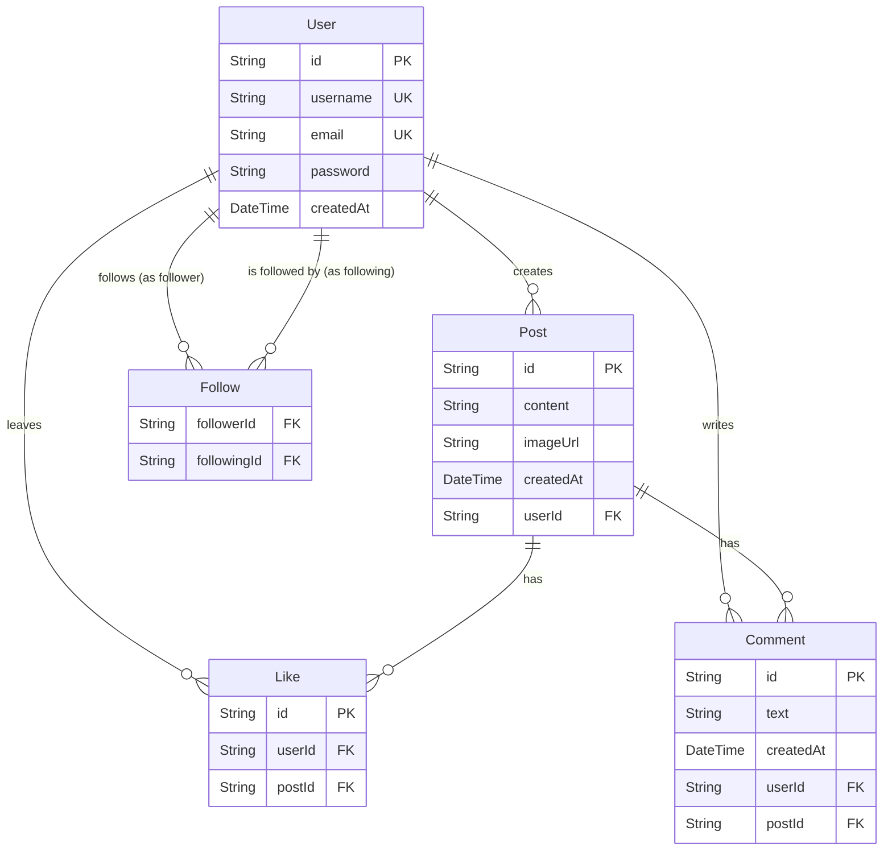

# Database Architecture & Schema Structure

This document outlines the database schema for the social media application. Since we have fully migrated away from Prisma ORM to Raw SQL, the structure here serves as the absolute source of truth for our MySQL tables and relationships.

<br>

## Entity Relationship Diagram



## Tables & Relationships

### 1. `User` Table
The central table handling authentication credentials and identities.
- **id** (`VARCHAR(191)` Primary Key)
- **username** (`VARCHAR(191)` Unique) 
- **email** (`VARCHAR(191)` Unique)
- **password** (`VARCHAR(191)`) - Hashed using bcrypt.
- **createdAt** (`DATETIME` / Custom default to `NOW()`)

### 2. `Post` Table
A table holding user-created content.
- **id** (`VARCHAR(191)` Primary Key)
- **content** (`TEXT`)
- **imageUrl** (`VARCHAR(191)` Nullable)
- **createdAt** (`DATETIME`)
- **userId** (`VARCHAR(191)` Foreign Key) $\rightarrow$ Relates to `User.id` on delete CASCADE.

### 3. `Like` Table
A Join table keeping track of user interactions on posts.
- **id** (`VARCHAR(191)` Primary Key)
- **userId** (`VARCHAR(191)` Foreign Key) $\rightarrow$ Relates to `User.id` on delete CASCADE.
- **postId** (`VARCHAR(191)` Foreign Key) $\rightarrow$ Relates to `Post.id` on delete CASCADE.
- **Composite Unique Index**: `(userId, postId)` – guarantees a user can't like the same post twice.

### 4. `Comment` Table
A table handling text replies associated with a specific post.
- **id** (`VARCHAR(191)` Primary Key)
- **text** (`TEXT`)
- **createdAt** (`DATETIME`)
- **userId** (`VARCHAR(191)` Foreign Key) $\rightarrow$ Relates to `User.id` on delete CASCADE.
- **postId** (`VARCHAR(191)` Foreign Key) $\rightarrow$ Relates to `Post.id` on delete CASCADE.

### 5. `Follow` Table
A Self-referencing Join table managing the follower/following system.
- **followerId** (`VARCHAR(191)` Foreign Key) $\rightarrow$ Relates to `User.id` on delete CASCADE.
- **followingId** (`VARCHAR(191)` Foreign Key) $\rightarrow$ Relates to `User.id` on delete CASCADE.
- **Composite Primary Key**: `(followerId, followingId)`

---

## SQL Creation Scripts (Reference only)

If you ever need to manually reconstruct these tables directly on Aiven or local MySQL, you can run the following standard SQL queries:

```sql
CREATE TABLE `User` (
  `id` VARCHAR(191) NOT NULL PRIMARY KEY,
  `username` VARCHAR(191) NOT NULL UNIQUE,
  `email` VARCHAR(191) NOT NULL UNIQUE,
  `password` VARCHAR(191) NOT NULL,
  `createdAt` DATETIME NOT NULL DEFAULT CURRENT_TIMESTAMP
);

CREATE TABLE `Post` (
  `id` VARCHAR(191) NOT NULL PRIMARY KEY,
  `content` TEXT NOT NULL,
  `imageUrl` VARCHAR(191) NULL,
  `createdAt` DATETIME NOT NULL DEFAULT CURRENT_TIMESTAMP,
  `userId` VARCHAR(191) NOT NULL,
  CONSTRAINT `Post_userId_fkey` FOREIGN KEY (`userId`) REFERENCES `User`(`id`) ON DELETE CASCADE
);

CREATE TABLE `Like` (
  `id` VARCHAR(191) NOT NULL PRIMARY KEY,
  `userId` VARCHAR(191) NOT NULL,
  `postId` VARCHAR(191) NOT NULL,
  UNIQUE KEY `Like_userId_postId_key` (`userId`, `postId`),
  CONSTRAINT `Like_userId_fkey` FOREIGN KEY (`userId`) REFERENCES `User`(`id`) ON DELETE CASCADE,
  CONSTRAINT `Like_postId_fkey` FOREIGN KEY (`postId`) REFERENCES `Post`(`id`) ON DELETE CASCADE
);

CREATE TABLE `Comment` (
  `id` VARCHAR(191) NOT NULL PRIMARY KEY,
  `text` TEXT NOT NULL,
  `createdAt` DATETIME NOT NULL DEFAULT CURRENT_TIMESTAMP,
  `userId` VARCHAR(191) NOT NULL,
  `postId` VARCHAR(191) NOT NULL,
  CONSTRAINT `Comment_userId_fkey` FOREIGN KEY (`userId`) REFERENCES `User`(`id`) ON DELETE CASCADE,
  CONSTRAINT `Comment_postId_fkey` FOREIGN KEY (`postId`) REFERENCES `Post`(`id`) ON DELETE CASCADE
);

CREATE TABLE `Follow` (
  `followerId` VARCHAR(191) NOT NULL,
  `followingId` VARCHAR(191) NOT NULL,
  PRIMARY KEY (`followerId`, `followingId`),
  CONSTRAINT `Follow_followerId_fkey` FOREIGN KEY (`followerId`) REFERENCES `User`(`id`) ON DELETE CASCADE,
  CONSTRAINT `Follow_followingId_fkey` FOREIGN KEY (`followingId`) REFERENCES `User`(`id`) ON DELETE CASCADE
);
```
