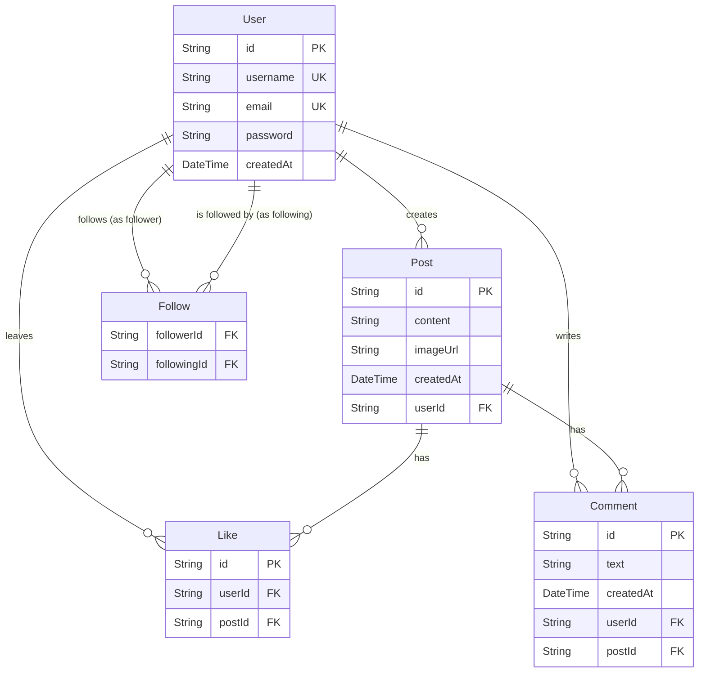

# Social App - Database & Architecture

This directory contains the core application code for the social media platform. A key focus of this project is the manual management of a MySQL database using raw SQL queries, ensuring high performance and clear logic.

---

## Database Architecture

We use a relational MySQL database to manage users, posts, and social interactions. Instead of an ORM, we interact with the database directly via the `mysql2` driver and parameterised queries.

### Entity Relationship Diagram (ERD)



---

## Tables & Schema Details

### 1. `User` Table
Handles authentication and user identities.
- **id**: `VARCHAR(191)` Primary Key
- **username**: `VARCHAR(191)` Unique
- **email**: `VARCHAR(191)` Unique
- **password**: `VARCHAR(191)` (Bcrypt hashed)
- **createdAt**: `DATETIME` (Default: `CURRENT_TIMESTAMP`)

### 2. `Post` Table
Stores user-generated content.
- **id**: `VARCHAR(191)` Primary Key
- **content**: `TEXT`
- **imageUrl**: `VARCHAR(191)` (Nullable)
- **createdAt**: `DATETIME` (Default: `CURRENT_TIMESTAMP`)
- **userId**: `VARCHAR(191)` (Foreign Key -> `User.id`)

### 3. `Like` Table
Manages "likes" on posts. Employs a composite unique index on `(userId, postId)` to prevent duplicate likes.
- **id**: `VARCHAR(191)` Primary Key
- **userId**: `VARCHAR(191)` (Foreign Key -> `User.id`)
- **postId**: `VARCHAR(191)` (Foreign Key -> `Post.id`)

### 4. `Comment` Table
Stores replies to posts.
- **id**: `VARCHAR(191)` Primary Key
- **text**: `TEXT`
- **createdAt**: `DATETIME` (Default: `CURRENT_TIMESTAMP`)
- **userId**: `VARCHAR(191)` (Foreign Key -> `User.id`)
- **postId**: `VARCHAR(191)` (Foreign Key -> `Post.id`)

### 5. `Follow` Table
Manages relationships between users. Uses a composite primary key on `(followerId, followingId)`.
- **followerId**: `VARCHAR(191)` (Foreign Key -> `User.id`)
- **followingId**: `VARCHAR(191)` (Foreign Key -> `User.id`)

---

## Automatic Initialisation

The database schema is automatically synchronised on application start. The file `lib/initDb.ts` contains the SQL logic to create all required tables if they do not already exist.

This process is orchestrated in `lib/db.ts`:
1. The MySQL connection pool is created.
2. `initDb.ts` is executed to verify/create the schema.
3. The application is allowed to proceed with queries.

This ensures that the application is "plug-and-play" once a valid `DATABASE_URL` is provided.

---

## Core Backend Logic (`app/api`)

The backend is structured as Next.js Route Handlers. Each route:
1. Obtains the database connection pool using `await dbReady`.
2. Verifies user authentication via `getAuthUser()` (if required).
3. Executes parameterised SQL queries to fetch or modify data.
4. Returns JSON responses with appropriate HTTP status codes.

---

## Development Workflow

1. **Database Schema Changes**: If you need to modify the schema, update `lib/initDb.ts` and `DATABASE.md`.
2. **Environment Setup**: Ensure your `.env` contains:
   ```env
   DATABASE_URL=mysql://...
   JWT_SECRET=...
   ```
3. **Execution**: Run `npm run dev` to start the development server. The database will be initialised on the first request.
